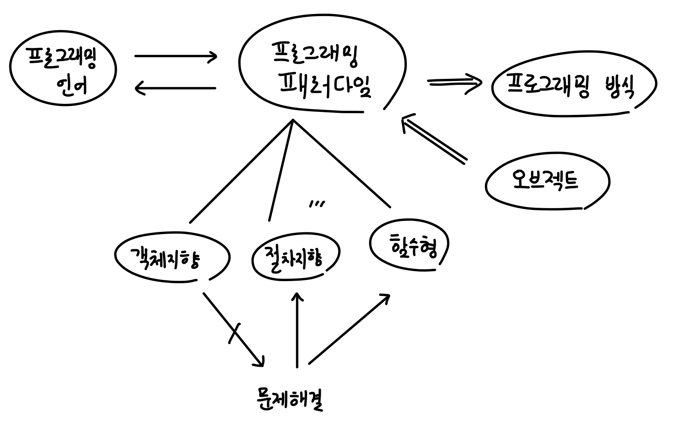
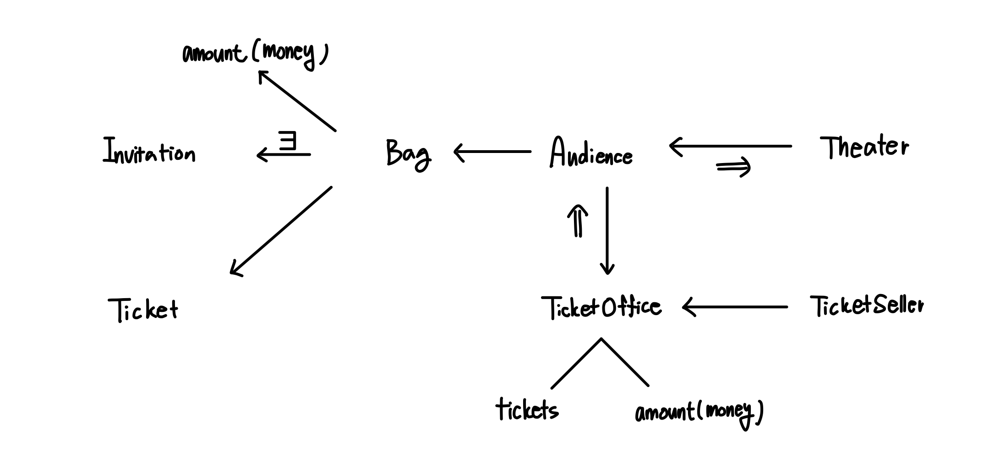
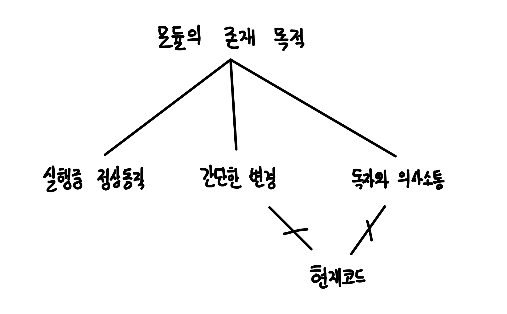
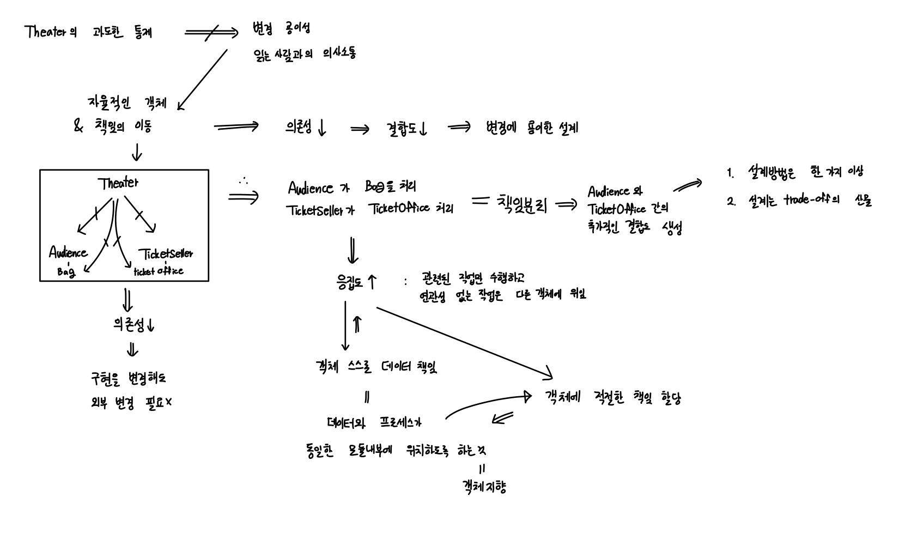
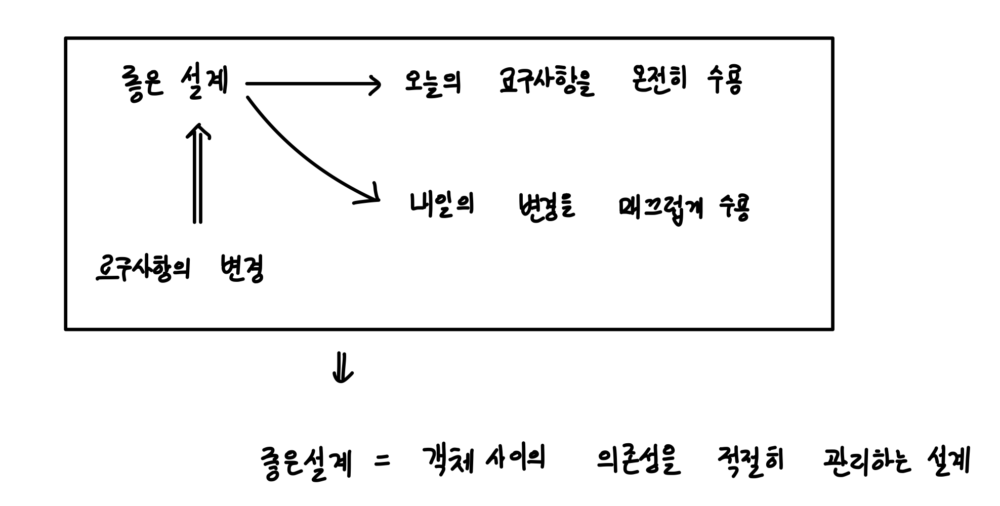

# chapter1 - 객체, 설계

# 시작에 앞서

예상했던 시간은 부쩍 지나버렸지만, 드디어 오브젝트 스터디의 포문을 열었다. 근거 없는 자신감이지만, 그래도 객체지향의 사실과 오해 스터디를 진행하면서 객체지향에 대해서 찍먹은
해보았다고 생각한다. 그래서 이번 스터디를 통해서 객체지향을 소화할 수 있다면 좋지 않을까 싶다. 또한 주로 다루고 있는 설계 토픽들이 어찌 우테코에서 보았던 주제 같아서
도움이 되지 않을까? 하는 개인적인 소망이 있다.

저자는 챕터에 들어가기 전에 간단히 객체지향의 필요성과 패러다임을 통해 이 책의 필요성에 대해서 설파하고 있다. 결국 우리는 이 책을 통해서 객체지향 패러다임을 배워서 적절하고
동일한 규칙과 방법을 적용할 수 있도록 노력해야 한다. 이 책을 통해서 객체지향의 정수를 흡수하자.

# Chapter1을 들어가면서

일반적인 이론과 실무와는 다르게 소프트웨어는 실무가 이론보다 앞선다고 말한다. 그래서 결국 중요하고 초점을 맞춰야 하는 부분은 코드 그 자체임을 명심하고자 한다. 각종 미사여구를
붙여도 결국 설계는 코드를 통해서 이야기해야 더 와닿는다고 생각한다.

확실히 이론적인 용어와 개념으로 학습하는 것보다 코드 한 줄을 더 쳐보고 고민해 볼 때 더욱 많은 성장을 했던 것 같다. 개발자는 언제나 개념으로 코드를 배우는 게 아닌 코드를
통해
개념을 배운다는 것을 기억하려고 한다.

# 티켓 판매 애플리케이션

다음은 직접 저자가 만든 간단한 예시를 기반으로 객체끼리 어떤 관계가 있는지를 내가 주로 사용했던 관계 도식을 통해 표현해본 그림이다.

앞으로도 다음의 도식화를 기반으로 생각을 고도화하고 구조화하는 연습을 해보고자 한다.

→ 단일 화살표는 충분조건과 필요조건을 의미한다.

: 예를 들어서 모든 Audience는 Bag을 가진다(필요로 한다) 따라서 화살표로 위와 같이 표현했다.

⇒ 이중 화살표는 원인과 결과를 나타낸다.

: TicketOffice로 인해서 Audience가 존재한다.

⇒ 과 → 이 같이 있는것은 다음과 같다.

관객이 존재하기 위해서는 TicketOffice를 필요로 한다. 라는 명제를 위와 같이 TicketOffice ⇒ Audience & Audience → TicketOffice로
표현하였다.
또한 극장이 존재하기 위해서는 관객이 필요하다. 따라서 위와 같이 나타내었다.

이렇게 도식화해서 객체 간의 관계를 중점적으로 도식화를 해보니 각 객체 간의 협력관계와 어떤 객체가 어떤 책임을 수행하는지가 얼추 파악이 가능했다. 앞으로도 의도적으로 도식화를
해보면서 협력과 책임과 역할을 적절히 구분해 내는 연습을 하려고 한다.

각설하고, 저자의 가이드에 따라 코드를 만들고 나면 정상적으로 동작하는 것을 확인할 수 있지만, 무언가 문제가 존재함을 바로 알아챌 수 있었다. 지나치게 Theater 의 책임이
많다는 것이다. 다른 것들의 책임까지 Theater가 책임지고 있었기 때문에 다른 변경의 파급효과가 너무 커졌던 문제가 발생했다.

(한 눈에 알아봤던 나 아주 칭찬해… ㅎ)

# 문제를 해결하자

저자는 모듈의 존재 목적에 관해서 설명하며 다음의 세 가지를 만족해야 한다고 설명했다. 하지만 현재 코드는 의사소통이 불가능한 코드이며, 간단한 변경(변경의 용이성)을 만족시키지
못하고 있다.

따라서 이를 위해서 할 수 있는 방법은 책임의 분리이다. 책임을 분리함으로써 의존성을 낮출 수 있으며, 이는 곧 결합도를 낮추는 결과를 낳는다. 즉, 변경에 대해 용이한 설계가
가능해진다. 또한 책임이 분리됨에 따라 코드를 읽고 이해하기가 쉬워진다는 장점을 가지게 된다.

따라서 책에서는 Audience가 Bag을 처리하고, TicketSeller가 TicketOffice를 처리하게 해서 의존성이 낮아지게 되었으며, 이를 통해 응집도(관련된 작업만
수행하고, 연관성 없는 작업은 다른 객체에 위임)를 높일 수 있었다. 응집도를 높였다는 것은 곧 객체에 적절한 책임을 할당함을 나타낸다.

하지만 Bag과 TicketOffice를 수정해서 책임을 분할하는 과정에서 추가적인 결합도가 생기기도 했다. 이는 설계 방법이 한 가지 이상이 존재하며, 설계는 트레이드 오프의
산물이라는 점을 암시한다.

# 좋은 설계란

종종 좋은 소프트웨어는 무엇인가? 또는 좋은 설계란 무엇인가?와 같은 질문을 혼자 던지며 생각에 잠기고는 한다. 이를 책에서는 객체지향스럽게 표현을 해주었다.

좋은 설계란 오늘의 요구사항을 수용하며, 내일의 변경을 매끄럽게 수용하는 설계라는 것이다. 소프트웨어 공학을 배울 때 요구사항이 계속해서 변하고 이에 따라서 많은 프로그래밍
방법론들이 나왔다는 것을 알기에 정말 적절한 표현이라고 생각했다.

또한, 이를 보면서 소프트웨어란 결국 유저를 위한 것이라는 것을 다시 한번 생각할 수 있게 되었다. 요구사항을 수용할 수 있는 설계는 그 자체로 유저와 소프트웨어가 상호작용 하는
과정에 있어서 계속해서 발전하고 진화한다는 것을 의미하고 있기 때문이다.

또한 객체는 협력을 위해서 각자의 역할과 책임을 다하는데, 이러한 과정에서 객체 사이의 의존성을 관리하는 것이 매우 중요하고 이걸 잘하는 것이 좋은 설계를 하는 역량이라고
생각하게 되었다.

# 후기

객체지향의 사실과 오해의 전반적인 내용을 코드 레벨에서 가볍게 훑은 느낌이다. 확실히 이전 스터디 덕에 이해의 폭이 더욱 넓어진 것 같다. 저자의 의도를 파악할 수 있는 건 참
재미있는 일인 것 같다.

또한 객체지향의 사실과 오해에서 얻은 깨달음들을 다시 검토할 수 있는 시간이었다. 그간 객사오에서 생각해 온 것들을 코드로 직접 확인해 보니 더욱 확실하게 이해가 갔다.
이번 예제를 절차적으로 따라 코딩해보면서 절차지향적으로 프로그래밍을 할 때의 발생할 수 있는 문제와 이에 대한 해결책으로 간략하게 객체지향 패러다임에 대해서 알아보았다.

나는 이전에 항상 자바로 프로그래밍하고 수정 사항이 생겼을 때, 변경에 의한 파급효과가 매번 너무 컸었는데, 이것이 내가 객체지향적인 사고를 못했고 절차적인 코드를 작성했기
때문이라는 점을 확실히 인지했다. 또한 작년 우테코를 진행하며 얼마나 추상화를하고 책임을 얼마나 분할하지에 대한 고민을 하다가 과한 추상화로 인해서 코드의 결합도가 너무 올라갔던
적이 있는데, 적절한 책임의 이동에 대해서 코드 레벨에서 주의 깊게 공부해야겠다 싶다.

이전 스터디에는 책을 보면서 단순히 내용을 정리하는 과정을 거쳤지만, 이제는 책을 보면서 정리하는 것 대신 도식화를 시켜 머릿속에 기억시키고 이를 기반으로 재정립해서 나만의 정리를
하고 그에 따른 사고의 전환 과정을 기록하는 것이 좋을 것 같다.