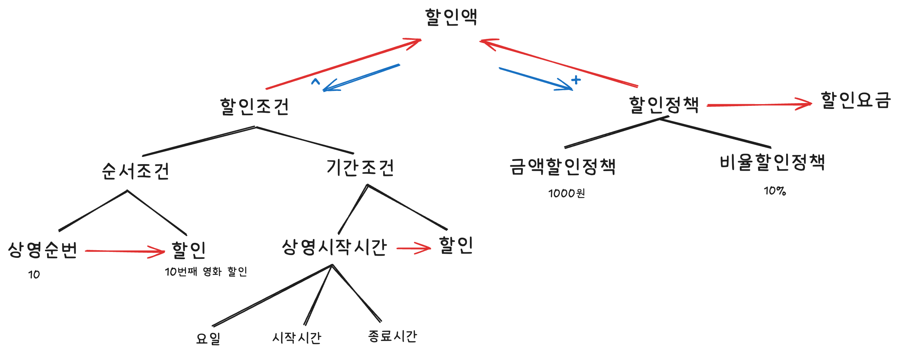

# chapter2 - 객체지향 프로그래밍

# 영화 예매 시스템

이번 챕터에서는 영화 예매 시스템을 다룬다. 이번 장의 목표는 얕고 가볍게 살펴보는 것이기 때문에 너무 무겁지 않게 집중해 보고자 한다.
다음은 저자가 언급한 영화 예매 시스템의 대략적인 그림이다.



따로 책에서 설명했기 때문에 복잡한 설명은 생략하기로 한다.
빨간색 화살표는 인과관계, 파란색 화살표는 조건을 나타낸다. ^는 여러 개가 가능한 것을 의미하며 +는 하나만 가능함을 의미한다.

즉, 할인 조건은 여러 개를 사용할 수 있지만, 할인 정책은 한 개 이하만 가능하다.

# 객체지향을 향해

지금껏 객체지향의 사실과 오해에서 배운 핵심은 다음과 같다.

클래스는 객체지향이 아니다.

객체지향은 객체들이 협력한다는 관점에서 바라보아야 한다.


### 도메인 다이어그램

다음은 사람들이 이 상영 프로세스에 대해서 어떻게 동작하는지에 대해서 생각하는 도메인모델이다. 유저가 바라보는 입장에서 그린 도메인 다이어그램 (UML)은 다음과 같다.

처음에는 할인정책과 할인 조건, 영화와의 관계에 대해 고민했지만, 영화라는 것 자체가 할인되기 뒤에서는 무조건 “얼마가 할인되는가?”가 선행이 된다. 즉, 할인 정책이 정해지고
나서 할인 조건이 정해진다고도 볼 수 있다. 따라서 다음과 같이 구축하였다.


이제 이렇게 만들어진 도메인 모델을 기반으로 해서 클래스 다이어그램을 구축하고 이를 기반으로 코드로 서술해 나가면 된다. 평소에 이렇게 도메인 모델을 그리고, 클래스 다이어그램을
그리는 연습을 해서 조금 더 구조를 머릿속에 그리고 생각해 보는 연습을 많이 진행해야 할 것 같다.

### 클래스 다이어그램

위의 도메인모델을 기반으로 해서 다음과 같이 클래스 다이어그램 구축이 가능하다.

여기서 확인해 볼 수 있는 것은 도메인 구조와 클래스 다이어그램의 구조가 일치하다는 것이고, 이것이 객체지향 설계의 장점이 된다. 확실히 유저의 멘탈모델을 그대로 프로그램으로
모델링이 가능하다면 유지보수의 측면에서 엄청나게 좋은 코드가 될 것이라고 생각을 한다. 과거에 소프트웨어 공학을 통해서 배웠던 모델링 과정을 통해서 깊이 있게 아키텍처에 관해서
서술이 가능하다는 것이 이런 것을 말하는 것이 아닐까 한다.


구현에서 가장 중요한 것은 내부와 외부를 분리하는 것. 즉, 구현과 인터페이스를 분리하는 것이다. 이를 통해서 객체의 자율성을 확보할 수 있으며, 이는 곧 확장가능하고 유지보수가
편한 코드가 된다.


# 코드로 알아보자

직접 클래스 다이어그램을 바탕으로 코드를 통해서 구현한 다음 비교 검증을 진행해 보고 싶지만, 책에서 "이런 식으로 만들거다"와 같이 설명을 해주고 있기 때문에, 코드를 통해서
객체지향
프로그래밍에 대해서 알아보고, 직접 구현은 과제를 통해서 직접 체험해 보면 좋지 않을까 생각을 한다.

따라서 직접 코드를 만들어서 비교하는 것이 아닌, 예제의 코드를 그대로 타이핑하고 이해해 보며, 객체지향이란 무엇이고 어떻게 코드를 짜야 깔끔하고 유지보수가 잘 되는 코드가
되는지에
대해서 알아보는 것에 초점을 맞추기로 했다. 물론 귀찮아서 그런 것도 어느정도 있다. (시간은 한정적이니까…)

예제를 구현하면서 거듭 감탄의 연속이었다. 소위 코드가 가독성이 떨어지고 유지보수가 안 되면 냄새가 나는 코드라고 하지 않는가? 하지만, 간단한 소규모의 영화 도메인을 가지고
저자가 만든 코드를 보며 코드에서 향기가 나는 것 같았다. 또 지금껏 내가 가진 객체지향 지식은 굉장히 빈약하다는 사실을 알게 되었다. 저자의 코드에서는 객체를 정말 살아있는
유기체처럼 존재했다.

저자의 코드를 보면서 객체가 자율성을 가져야 한다는 것이 어떤 것인지에 대해서 다시 한번 느끼게 되었고, 깔끔하게 협력 과정을 수행하는 객체들을 조망하면서 정말 하나의 세계를
창조하는 듯한 새로움을 느끼게 됐다.

코드를 구현하면서도 처음에는 설명을 봐도 이게 무슨 말이지 싶은 경우가 종종 있고, 이렇게까지 짜야 해? 라고 생각을 했지만, 만들어진 것들을 보며 짜임새있게 만들어진 것을 보고
코드를 이렇게 짜는 거구나라는 감이 조금 생긴 것 같다. 또한 가장 크게 느낀 것은 변수명을 짓는 스타일과 방법인 것 같다.

변수명을 봤을 때 확실히 도메인을 완벽하게 이해하지 못해도, 어 이러한 것들을 하는 거겠네? 와 같이 유추가 가능하다는 것을 보고 변수명을 직관적으로 이해가 가능하도록 지어야겠다는
생각을 했다.

가장 인상 깊었던, 머릿속에 새겨놓으면 좋을만한 것들은 다음과 같다.

- 의미를 명시적이고 분명히 표현 가능하다면 객체를 사용하자.
- 함수를 호출하는 것이 아닌, 메시지를 “보내는 것”

    ```java
    // Screening이 Movie의 calculateMovieFee() 메서드를 호출하는 것이 아닌,
    // Screening이 Mvoie에게 calculateMovieFee()라는 메시지를 전하는 것임
    return movie.calculateMovieFee(this).times(audienceCount);
    ```

- 기본적인 알고리즘 흐름을 부모 클래스에 구현하고, 중간에 필요한 처리를 자식에게 위임하는 디자인 패턴을 TEMPLATE METHOD 패턴이라 한다.
- 코드의 의존성과 실행 시점의 의존성이 다를 수 있다. (다형성을 활용할 때 발생하는 효과 → 확장 가능한 객체지향 설계가 가능해진다)
- 하지만 이렇게 의존성이 다르면 다를수록 이해하기에는 어려워진다. ⇒ 결국 트레이드오프다
- 설계가 유연해지면 이해와 디버깅이 어렵고, 가독성을 생각하면 재사용과 확장 가능성이 낮아진다. 개발자라면 유연성과 가독성 사이에서 고민해야 한다.
- 상속은 기존 클래스를 기반으로 새로운 클래스를 빠르게 추가할 수 있는 방법으로, 부모 클래스와 다른 부분만을 추가해서 새로운 클래스를 만드는 법을 Programming by
  difference라 한다.
- 상속의 목적은 모든 인터페이스를 물려받는다는 것이다. 결코 메서드나 인스턴스 변수를 재활용하기 위함이 아니다. 인터페이스는 수신가능한 메시지의 집합이다. 즉, 자식클래스와
  부모클래스를 동일한 타입으로 간주할 수 있다.
- Movie는 DiscountPolicy에 메시지를 전송하지만, 실제 어떤 메서드가 실행될지는 객체의 클래스에 따라 달라진다. 이를 다형성이라 한다.
- 이렇게 메시지와 메서드를 실행 시점에 바인딩하는 것을 lazy binding, dynamic binding이라 한다.
- 이 예제에서는 인터페이스와 내부 구현을 함께 상속하도록 했다. 하지만, 구현은 하나도 없이 인터페이스만 공유할 때 인터페이스라는 프로그래밍 요소를 사용한다.
- 책임의 위치를 결정하기 위해서 조건문을 사용하는 것은 협력의 설계 측면에서 대부분의 경우 좋지 않은 선택이다. 항상 예외 케이스를 최소화하고 일관성을 유지할 수 있는 방법을
  선택하라.
- 추상화를 통해 설계하면 유연하고 확장 가능한 설계가 가능해진다.

가장 인상 깊었던 것은 다음의 구절이다.

> 구현과 관련된 모든 것들이 트레이드 오프의 대상이 될 수 있다는 사실이다. 여러분이 작성하는 모든 코드에는 합당한 이유가 있어야 한다. 비록 아주 사소한 결정이더라도
> 트레이드오프를 통해 얻어진 결론과 그렇지 않은 결로 사이의 차이는 크다. 고민하고 트레이드오프하라.


왜냐하면 지금까지 코드를 구현할 때 아무 생각 없이 기능에만 초점을 맞춘 채 돌아가네? 아싸 그리고 안 돌아가네? 왜 안 돌아가지? 와 같이 단편적인 생각으로 프로그래밍했던 것
같다. 내가 작성하는 코드에는 합당한 이유가 있어야 한다는 것이 어떤 코드를 어떤 언어로 작성을 하더라도 이런 마음가짐을 가지고 있다면 더 좋은 퀄리티의 코드가 나올 수 있을 것
같다.

# 상속보다 합성을 사용하라

흔히 객체지향 설계에 관한 이야기를 하다 보면 상속은 쓰지 말고 합성을 써라 와 같은 말을 종종 듣고는 했다. 물론 과거의 얄팍한 지식으로는 합성에 관해서 이해하지 못했지만
말이다.

합성은 다른 객체의 인스턴스를 자신의 인스턴스 변수로 포함해서 재활용하는 방법을 말한다.

그렇다면 왜 합성을 권장했던 걸까

1. 캡슐화를 위반한다. ⇒ 부모를 바꾸면 자식까지 영향이 미친다.
2. 설계가 유연하지 않다. ⇒ 만일 정책을 A에서 B로 바꿀 때 클래스에서 다 바꿔줘야 한다.

하지만 합성은 객체가 인터페이스를 통해서 약하게 결합된다. 위의 예제에서는 Movie는 DicountPolicy가 외부에 calculateDiscountAmount메서드를
제공한다는 것만 알고 내부 구현에 대해서 알지 못한다. 하지만 상속은 클래스를 통해서 강하게 결합된다. 따라서 코드 재사용을 위해서는 합성을 선호하는 것이 좋다.

합성에 대해서 이해하지 못했는데, 그냥 기존에 인터페이스를 만들고 그거를 오버라이딩하고, 객체가 인스턴스를 가지고 생성자 주입해서 사용하던 것들이 합성이였다. 아마도 김영한씨의
스프링 강의를 감명깊게 본 탓인지 객체지향을 조금 더 입체적으로 이해할 수 있었던 것 같다.

# 왜 모먼트

이제 적을 때마다 매번 왜 모먼트를 적고 질문 하나를 만들고 그거에 대해서 생각해서 답을 하는 것을 해볼까 합니다

도메인 모델에서 왜 유저는 빠져있는걸까?

My Answer:

도메인 모델 자체가 유저가 바라보는 프로그램 모델이기 때문에, 유저가 존재하지 않는 것이 아닐까 생각함. 유저는 이미 트리거를 한 상황이고, 그 플로우가 돌아가면서 어떻게 진행되는
것인가를 초점으로 만들어진 모델이기 때문에 없다고 생각함. 즉, 유저의 도메인 모델 자체가 유저의 멘탈모델을 그대로 모델링한 것이기 때문에 이렇게 된 것. 그리고 유저가 시스템의
핵심 비즈니스에 영향을 미치게 된다면 그때 구성요소로서 동작하게 될 것.

AI Answer:

- **시스템의 경계 (System Boundary)**
  도메인 모델은 우리가 만들고자 하는 **'영화 예매 시스템' 내부의** 핵심 개념과 규칙을 표현합니다. 여기서 '유저(User)' 또는 '고객(Customer)'은 시스템과
  상호작용하는 **외부의 '액터(Actor)'** 로 간주됩니다. 즉, 시스템의 문을 두드려 "영화 예매할게요!"라고 요청하는 존재이지, 시스템의 핵심 부품은 아닌 것이죠.
  모델은 그 요청을 받은 후 시스템 *내부에서* 어떤 일들이 벌어지는지에 집중합니다.
- **모델의 초점과 책임**
  제시된 다이어그램의 주된 관심사는 **'요금 계산'** 입니다. 영화(Movie), 상영(Screening), 할인 정책(DiscountPolicy), 할인 조건(
  DiscountCondition) 등은 모두 정확한 요금을 계산하는 책임을 수행하기 위해 서로 협력하는 객체들입니다. '유저'는 이 요금 계산 과정에 직접적으로 참여하지
  않습니다. 그저 "이 영화 얼마예요?"라고 묻고 계산된 결과를 받을 뿐입니다.
- **역할의 차이: 행위의 주체 vs. 로직의 구성요소**
  유저는 **행위의 주체(Trigger)** 입니다. 유저의 '예매한다'는 행위가 없다면 시스템은 동작하지 않겠죠. 하지만 도메인 모델은 그 행위 이후에 벌어지는 **내부 로직의
  구성요소** 들을 표현한 것입니다. 비유하자면, 식당의 '손님'은 주문을 하는 행위의 주체이지만, '주방'의 레시피(도메인 모델)에는 '요리사', '재료', '조리법' 등이
  핵심 구성요소로 들어가는 것과 같습니다.

# 이번 챕터를 마무리하며

이전에 오브젝트를 읽지는 않았지만, 강의만 들은 적이 있다. 그 당시에는 코드를 따라 치고, 강의의 내용을 이해해 보려고 노력해도, 저자가 말하는 내용이 10이라고 하면 내가
받아서
이해하는 정도가 2 정도 됐던 것 같다.

현재는 성장한 덕인지 모르겠지만 7 정도는 이해하고 있지 않을까 하는 걱정스러운 마음이 있다. 그래도 객사오 스터디와 산학협력 프로젝트, 대학교 강의에 열심히 참여했던 것이 빛을
발하고 있는 순간들이 아닐까 하는 생각을 한다.

최근 들어서 객체지향이라는 토픽에 대해서 관심이 많고, 좋은 코드를 작성하는 것에 목표를 두고 있지만, 실질적으로 개발자는 기능을 구현할 수 있어야하는 거 아닌가? 하는 걱정이
들기도 한다. 왜냐하면 프로젝트를 아직 진행해본 적이 없으니까 말이다. (말하니까 매우 부끄러운 일이네용 ㅋㅋ) 그래도 많은 성장을 이루고 있는 것 같아서 기분이 좋다.

하지만 자바에 대한 원론적인 이해가 부족하고 더욱 언어 자체의 숙련도를 쌓는데에 정진을 해야하지 않을까 하는 생각도 든다. 또한, 좋은 코드를 보고 배우라는 것이 무슨 말인지 많은
공감을 하게 되는 대목이어서 좋았던 것 같다. 앞으로도 더 좋은 코드를 만들고, 더 잘 만들 수 있게끔 열심히 살아야 할 것 같다.